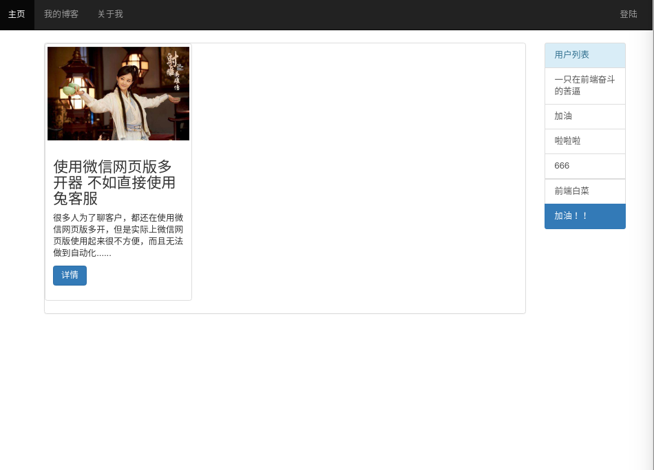
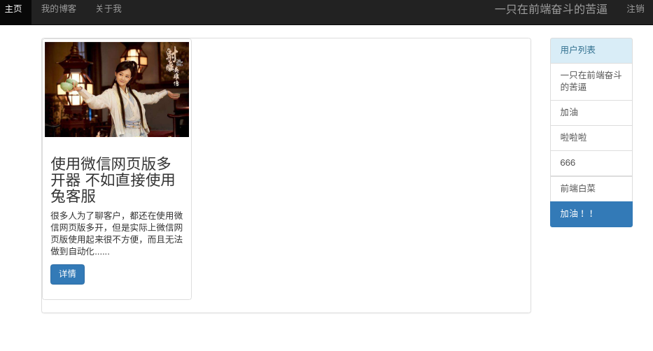
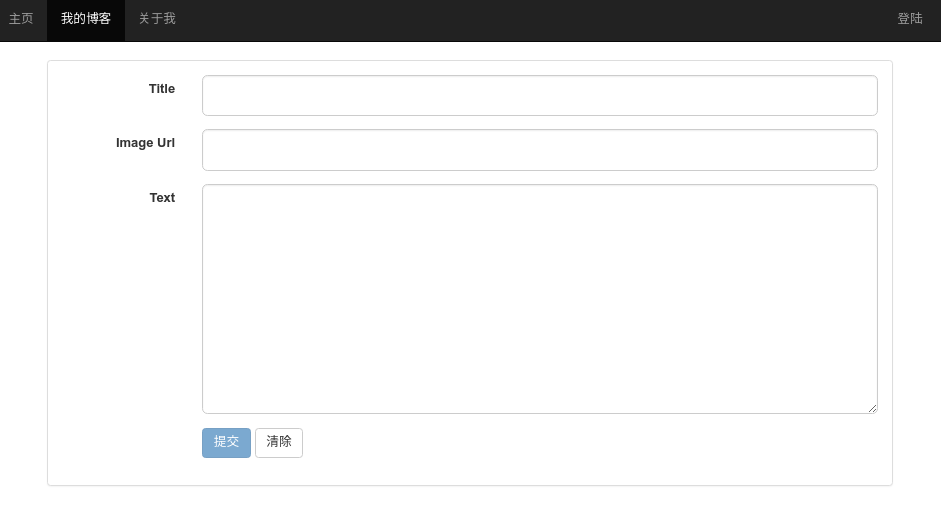
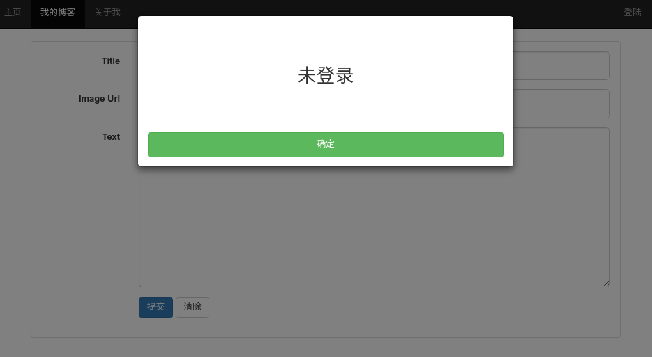
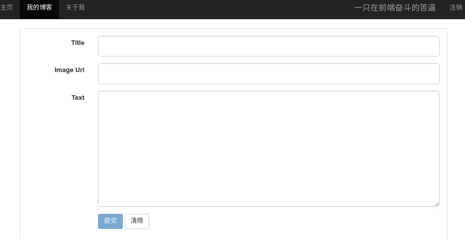
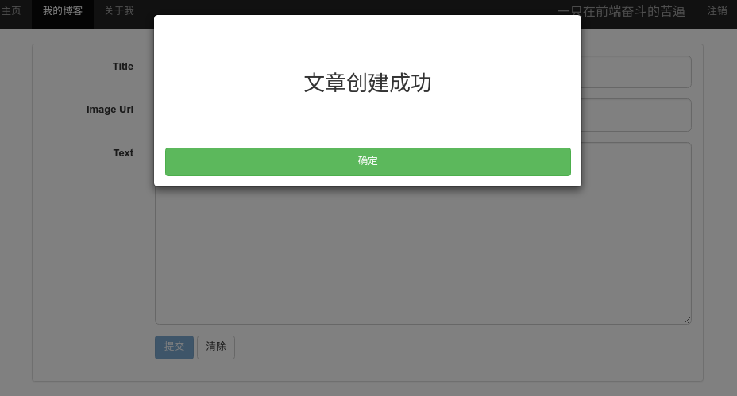
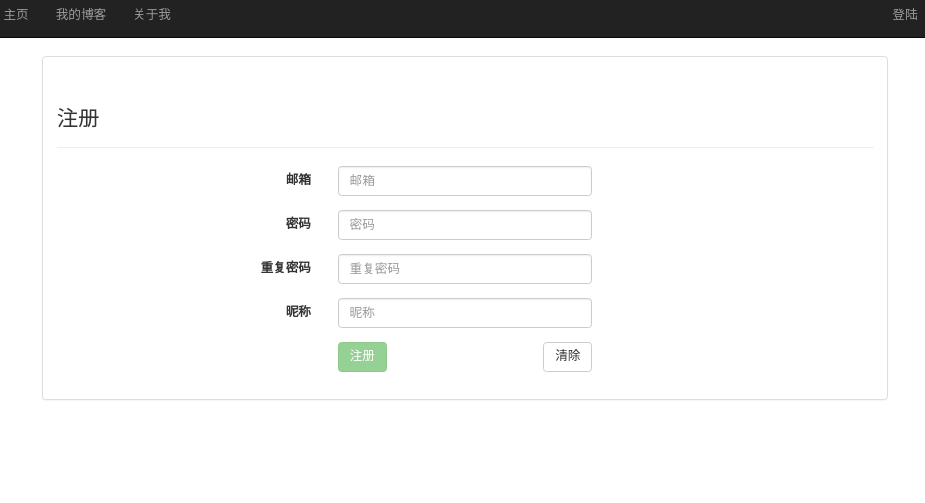
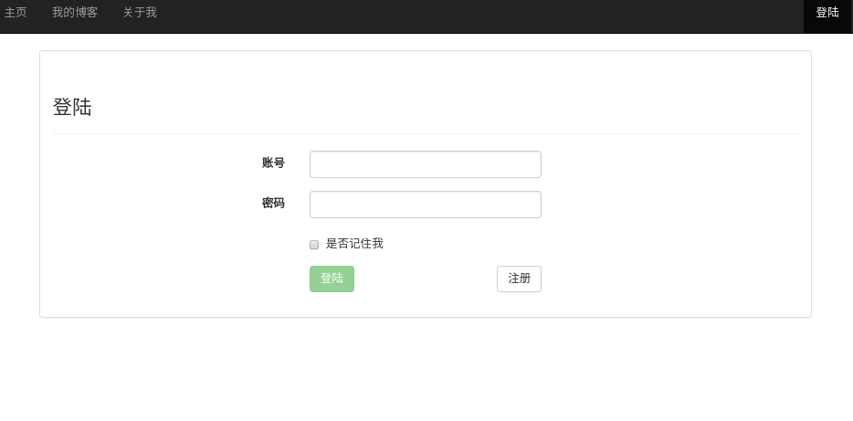
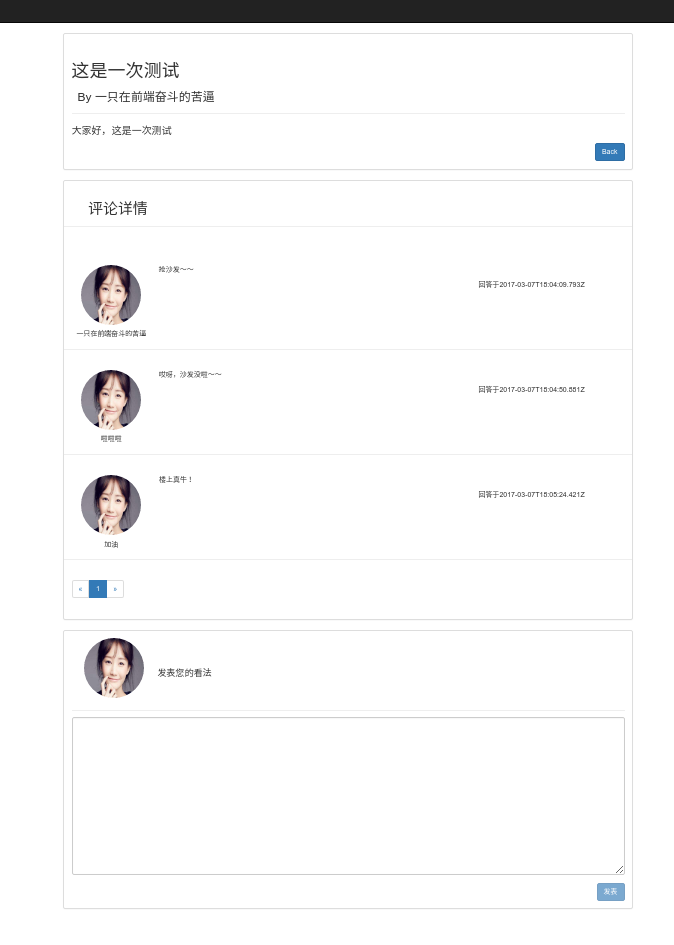

[TOC]
# 基于Angular2+bootstrap+nodejs+mongoose+RxJS搭建的多人博客系统
### 介绍
1. 项目介绍：该前端采用了Angular2作为框架，bootstrap作为样式设计框架；服务端使用nodejs的express框架进行搭建，使用mongodb数据库进行数据的存储；所有的异步操作，都是使用RxJS进行完成的。其中，我并未采用其原生的express框架，而是在它的基础上进行了自己的改造，当然，还是基于MVC模型的，不过V层的逻辑在前端就已经实现好了，所以服务端只需关注M层和C层即可。
2. 功能说明：该博客目前实现了注册、登陆、编辑文章、浏览文章、评论文章、获取博客主列表、获取自己信息等的功能。另外，只有登陆后才能发表文章和发表评论，且不同人还能浏览和评论其他人的文章。功能还有待完善和添加。
3. 这个项目是本人作为一个新手用来练练手的，所有该系统目前还存在很多bug，待后面有时间时修补，路过的大牛勿喷～～
4. 后面计划前端导入markdown来对文本进行显示和编辑，以及修复bug，添加功能

### 项目运行
1. 首先，本地上需安装nodejs、mongodb和angular-cli
2. 在将项目下载后，分别在blog-client和blog-server下运行npm install命令，安装所需的依赖模块
3. 安装完成后，先在本地运行mongod以启动数据库，然后在blog-server下运行node server.js以启动服务器，接下来在blog-client下运行ng server以启动客户端，最后在浏览器中输入localhost:4200即可进入该系统

### 项目收获
1. 首先自然是初步地学习了bootstrap的使用啦
2. 在这个寒假中，我在家自学了angular2和RxJS，在看了《ng-book2-r43》和《rxjs》这两本书并且跟着里面提供的样例打了一遍代码后后，总觉得效果不是很大。于是趁着最近有时间，自己独自用它们写了一个简单的多人博客系统。由于前后端都是自己一个人写的，期间也遇见了很多问题，但总算是磕磕绊绊的花了5天完成了，虽然这个博客系统显的非常简陋。。。
3. 使用angular2的最大感触是其模块化的思想。在搭建一个页面的时候，先要考虑一个页面由什么构成，然后再将页面分成若干个模块，模块内部也可以包含其它模块，各个模块之间的通信方式以及内容，在完成所需模块后，再将它们拼接在一起形成一个页面。个人觉得，这样的好处有三个，其一，是在完成一个模块时，我们只需要关注该模块内部的逻辑和样式以及这个模块需要暴露哪些接口供外部来调用即可，而无需去考虑外部的情况，这样由于封装了内部逻辑，降低了模块之间的耦合度，出现问题时能快速进行定位；其二，是我在项目事件中，发现其实有些模块是在不同页面中都会用到的，这样的话，我们就可以复用这些模块，加快了开发效率，避免代码的重复写；其三，是可以以一种“阶段性”（自己造的词）的方法来构造我们的单页面应用，即在构建模块这一阶段时，我们可以只关注模块内部的逻辑实现和样式构造；在拼接模块这一阶段时，我们只需要关注模块之间应该如何通信，以及它们应该放在页面的哪个位置。
4. nodejs的话是原来就会的，所以整体上耗在这块的时间相对少的多。不过我并不是直接用express自己搭建的框架，而是自己构造了一个自己认为合适的架构，当然还是基于MVC的，只不过V层已经交由前端angular2负责，所有服务端就无需理会该层即可，这也是前后端分离的一个好处，服务端可以只关注数据的处理逻辑。在实现服务端时，再次拾起了mongoose的使用。之前也用mongodb作为数据库实现过另一个项目，用mongodb进行数据库操作而不是mongoose。这次去看了看它的官网，大致学习了下增、删、改、查的实现方法，然后在其基础上，自己用RxJS将这些方法封装成一个工具模块，供上层直接调用。还有就是，服务端采用了分级路由的思想，但由于规模较小，个人在写时，也就在article路由下挂了comment的路由。

### 问题记录
说明：由于时间问题，这里就暂时只对我印象深刻的问题进行记录
1. 在对接前后端时，出现了跨域的问题。首先我们先来分析下为什么会出现跨域问题吧。
当我们要运行angular2时，我们先运行了**ng server**，而该命令其实就是启动一个小型web服务器，用于托管应用，所以当我们在浏览器中输入http://localhost:4200时，其实是浏览器向该服务器发起了一次请求，请求得到响应后才能在浏览器中显示我们的angular单应用程序。而当我们在该应用中向我们自己搭建的node服务器发起请求时，此时自然就发生了跨域啦。而在浏览器中，默认情况下，跨域请求是不会带上cookie的，但在我们的应用中，需要判断用户是否已经登陆，这显然只能通过cookie来实现，所以我们就必须要求其发起的请求必须带上cookie了。
那么，如何实现在跨域中带上cookie呢？详细讲解可以看[阮一峰老师的日志](http://www.ruanyifeng.com/blog/2016/04/cors.html)。这里我就简单的讲下我的解决方案：
首先，在每次发起请求前，设置**withCredentials**为**true**，这是告诉浏览器在进行跨域请求带上cookie。但这还不够，我们还需要在服务端中的**响应头部**中设置**Access-Control-Allow-Credentials**为**true**，这是**服务器**用于告诉浏览器说它**允许**行浏览器发起的请求中带有cookie，这样浏览器才不会对服务端发回的响应进行拦截。但要注意的是，如果指定credentials为true的话，服务端的**Access-Control-Allow-Origin**就不能设为星号，必须指定明确的、与请求网页一致的域名。下面就贴上具体的代码：
```javascript
  // 客户端
  this.http.get(url, { withCredentials: true })
  ......
  this.http.post(url, body, { withCredentials: true })
  ......
  // 服务端
  app.all('/*', function(req, res, next) {
    res.header("Access-Control-Allow-Origin", "http://localhost:4200");
    // Set to true if you need the website to include cookies in  requests
    res.header('Access-Control-Allow-Credentials', true);
    ......
    next();
  });
```
2. 在实现前端时，刚开始我是将html和ts文件分开放的，但在后来却发现，这种划分使得代码很难管理，因为同一个组件的html和ts分开放就意味着每次要定位到该模块时，总要在多个不同的文件中来回找，这显然大大降低了开发效率。后来我决定采用官网上提倡的将同属于一个组件的文件放在一起的作法，即html和ts放在一起，发现这样以后确实容易管理多了。
3. 在前后端对接时，由于一开始没有先写好api文档，所有因前后端的字段细节不一致而导致总是出错。看来即使是一个人的项目，还是需要先写好api文档，定好字段，然后前后端再根据这个文档进行开发。
4. 在进行组件间通信的实现时，刚开始我只想到了通过暴露组件接口，即inputs和outputs来实现，但这会有一个很大的问题，就是这只适合于组件之间的关系一旦定好后就不会发生变动的场景，而对于经常发生变动的组件——例如，有一个导航组件块A和一个页面组件B，当点击A的其中一个选项时，跳到B，而点击A的其它选项时，则跳到其它页面组件——显然就不太合适了（虽然也可以实现，但不可避免的需要维护一大堆变量，而大部分变量对当前页面组件确实没有用处的）。而这种场景下的解决方案是使用服务来进行通信，利用服务的单例模式，这也是我比较偏爱的一种解决方法，当然，除了这种方案外，还有其它的。下面就贴上我采取的方案的代码实现：
```javascript
// 服务
@Injectable()
export class AlertPopService {
  message: EventEmitter<Object> = new EventEmitter<Object>();
}
// 注册服务消息接受器
alertService.message.subscribe(
      value => {
        this.message = value.message;
        this.callback = value.callback;
      }
)
// 调用服务消息发射器
this.alertService.message.emit({ message: res.msg, callback: this.navToHome.bind(this) });
```
5. 在客户端我们能通过localStorage来对我们的一些简单的数据进行缓存，这样就能避免进行多次请求，提高体验效果。但是需要注意的是，但我们需要用它来缓存一个对象时，先要调用JSON.stringify()将之转成json然后再保存，否则的话在后面读取该数据后要获取其某个属性值时就会出错。

### 效果图
下面就贴上截图看看大概效果吧～
1. 主页：注意右上角的变化
登陆前
 
登陆后
 
2. 文章发表页
登陆前
 
 
登陆后
 
 
3. 注册页
 
4. 登陆页
 
5. 文章详情页
 
